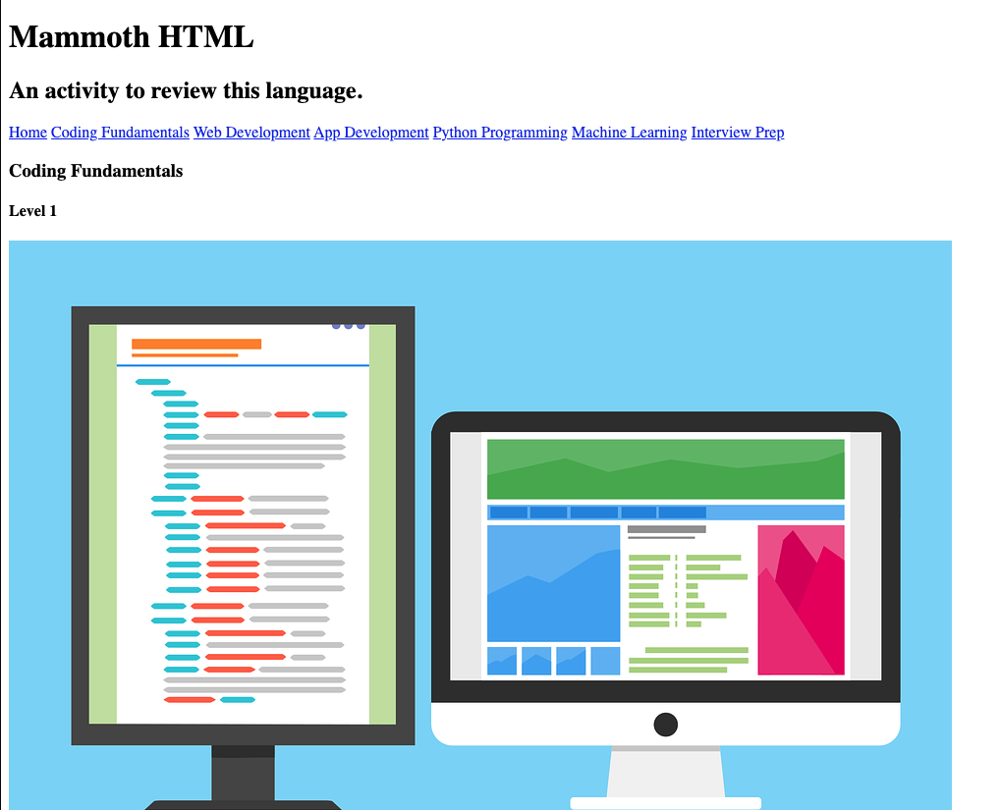

# Mammoth HTML

A coding tutorial created to review and practice HTML. Completed through Mammoth Interactive at [link to Mammoth Interactive Homepage](https://training.mammothinteractive.com/courses).

## Tech Used
HTML

## Dependencies
None. Viewer only need to utilze Live Server throught the index.html file.

## Uses
To practice and visualize a basic but well organzied HTML file and how it would appear in a browser.

## How I veered from the original project
I found my own images based on the instructors images and changed some of the original header and sub-header.

## History
After completeing a Software Engineering certification program and during my job search, I needed to continue to pracitce my skill set in order to maintain it and learn more. I thought that even the most basic projects using the most basic language was a great place to start.

